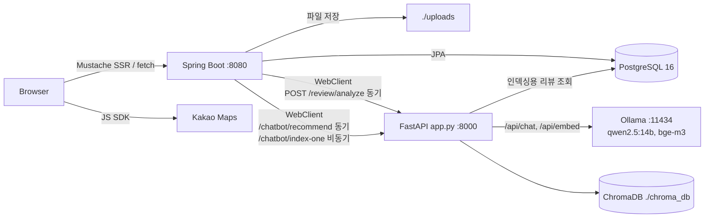
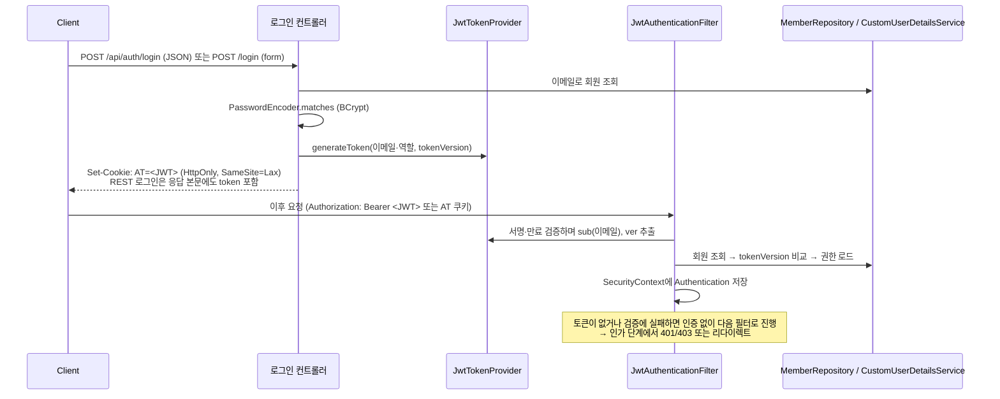

> 이 문서는 MyPickCafe의 상세 기술 설계 문서다. 프로젝트 개요는 [README](README.md) 참고.

# MyPickCafe

리뷰 데이터를 기반으로 카페를 탐색하고 추천받는 웹 서비스입니다.

- **구성**: Spring Boot(카페·리뷰·회원·인증) + FastAPI(리뷰 태그/감성 분석, 자연어 추천 RAG) + 로컬 LLM(Ollama)
- **핵심 기술**: Java 17 / Spring Boot 3.5.5, Spring Security + JWT(stateless), JPA + PostgreSQL, FastAPI + ChromaDB + `qwen2.5:14b`·`bge-m3`
- **성격**: 학교 팀 프로젝트(GoCafe)를 개인적으로 이어받아 재작업한 프로젝트입니다. → [비고](#비고)
- **코드로 확인되는 작업**: JWT 인증·인가(`tokenVersion` 기반 토큰 무효화, DB 기준 권한 결정), 엔티티 대신 record 응답 DTO 사용, AI 서버 연동과 장애 격리, 인가·응답 노출·서비스 단위 테스트

> **진행 상태: 로컬 실행 / 배포 진행 중**
> 클라우드 배포는 아직 이루어지지 않았습니다. 저장소에는 운영용 프로파일 설정(`application-prod.properties`)만 있고, Dockerfile·CI 설정은 없습니다.
> 배포 계획: `[여기 직접 확인/작성]`

---

## 목차

- [기술 스택](#기술-스택)
- [주요 동작 흐름](#주요-동작-흐름)
- [아키텍처 개요](#아키텍처-개요)
- [인증 · 인가](#인증--인가)
- [로컬 실행 방법](#로컬-실행-방법)
- [테스트](#테스트)
- [현재 한계 (코드 기준)](#현재-한계-코드-기준)
- [비고](#비고)

---

## 기술 스택

### Backend — `MyPickCafe_Springboot/` (`build.gradle` 기준)

| 구분 | 사용 기술 |
|---|---|
| 언어 / 빌드 | Java 17 (Gradle toolchain), Gradle Wrapper 8.14.3 |
| 프레임워크 | Spring Boot 3.5.5 — `web`, `data-jpa`, `validation`, `mustache` |
| 인증 · 인가 | Spring Security (`spring-boot-starter-security`) — 필터 체인, `@EnableMethodSecurity`, `BCryptPasswordEncoder` |
| JWT | `io.jsonwebtoken:jjwt-api` 0.11.5 (implementation), `jjwt-impl` 0.11.5 · `jjwt-jackson` 0.11.5 (runtimeOnly) — HS256 서명 |
| 외부 AI 서버 호출 | `spring-boot-starter-webflux`의 `WebClient` (앱은 서블릿 스택으로 기동) |
| XSS 방어 | jsoup 1.17.2 (`Safelist.basic()`으로 요청 파라미터 정제) |
| API 문서 | springdoc-openapi 2.8.6 (Swagger UI, **dev 프로파일에서만** 활성) |
| DB | PostgreSQL (런타임 드라이버), PostgreSQL 16 컨테이너 (`docker-compose.yml`) |
| 뷰 | Mustache 서버 사이드 렌더링 + Vanilla JS (`static/js/cafego.js`) |
| 지도 | Kakao Maps JavaScript SDK (지도 탐색 페이지) |
| 기타 | Lombok |
| 테스트 | `spring-boot-starter-test`, `spring-security-test` (`@WithMockUser`), H2 (테스트 전용 인메모리 DB) |

### AI 서버 — `MyPickCafe_AI/` (`requirements.txt`, `config.py` 기준)

| 구분 | 사용 기술 |
|---|---|
| 서버 | Python, FastAPI, Uvicorn |
| 모델 실행 | Ollama (로컬, 기본 `http://localhost:11434`) — `/api/chat`, `/api/embed` HTTP 호출 |
| 사용 모델 (코드 기본값) | 생성/분석: `qwen2.5:14b` · 임베딩: `bge-m3` |
| 벡터 DB | ChromaDB (PersistentClient, cosine) |
| 기타 | httpx, pydantic / pydantic-settings, psycopg (인덱싱용 PostgreSQL 조회) |
| 더미 데이터 생성 | ollama(Python 패키지), playwright, requests |

> AI 기능은 Ollama로 띄운 공개 모델을 FastAPI 서버에서 HTTP로 호출하는 구조입니다.

---

## 주요 동작 흐름

역할은 `MEMBER` / `CAFEOWNER` / `ADMIN` 세 가지입니다. `CustomUserDetailsService`에서 ADMIN은 CAFEOWNER·MEMBER 권한을, CAFEOWNER는 MEMBER 권한을 함께 받습니다.

### 1. 리뷰 작성 → AI 태그·감성 분석 → 카페 태그 집계 (`ReviewService`)

1. 리뷰를 DB에 먼저 저장합니다. 점주가 아닌 사용자가 작성하면 점주에게 알림이 갑니다.
2. FastAPI `POST /review/analyze`를 **동기** 호출해 태그와 감성을 받습니다. AI 서버는 few-shot 프롬프트로 `qwen2.5:14b`를 호출하고, 허용 목록에 있는 태그들을 받아옵니다.
   - 태그 4개 카테고리: `FACILITY`(WIFI, PLUG, TERRACE, PET, PARKING) · `MENU`(AMERICANO, LATTE, COLDBREW, BAKERY, CAKE, ADE, DESSERT) · `PURPOSE`(STUDY, TALK, REST, DATE, PHOTO, MEETING) · `MOOD`(MODERN, RETRO, NATURE, INDUSTRIAL, CLASSIC)
   - 감성: `GOOD` / `BAD` / `null`
3. 받은 태그를 `review_tag`에 저장합니다. 이어서 카페의 GOOD 리뷰 태그를 카테고리별로 집계해, **카테고리 1위 태그와, 그 개수의 85% 이상인 모든 태그들**을 카페 태그(`cafe_tag`)로 다시 반영합니다. 상위 N개로 자르지 않으므로 리뷰 수가 적은 카페에도 태그가 붙습니다.
4. 챗봇 서버 `POST /chatbot/index-one`을 비동기(fire-and-forget)로 호출해 리뷰를 ChromaDB에 upsert합니다.

> **AI 서버 장애 격리**: `WebClient`에 연결 2초·응답 10초 타임아웃이 걸려 있습니다. 호출이 실패하면 예외를 던지지 않고 빈 결과를 돌려주므로, 리뷰는 태그 없이 정상 저장됩니다 (`AiClientDegradationTest`로 검증).

### 2. 픽봇 — 자연어 추천 (RAG)

`/cafes` 페이지의 "픽봇" 탭 → `POST /api/chatbot/recommend` → FastAPI `POST /chatbot/recommend`

1. 사용자 질의를 `bge-m3`로 임베딩합니다.
2. ChromaDB에서 코사인 유사도로 리뷰를 검색합니다. 한 카페가 결과를 독점하지 않도록 카페별 리뷰 수에 상한을 둡니다(1위 카페 최대 5건, 순위가 내려갈수록 1건씩 감소, 최소 1건).
3. 카페별 최고 점수 기준 상위 5개 카페를 컨텍스트로 넣고 `qwen2.5:14b`에 JSON 형식의 추천 결과를 요청합니다.
4. LLM 호출이 실패하면 벡터 검색 결과를 그대로 반환하고, Spring은 챗봇 서버 호출이 실패하면 빈 목록을 반환합니다.
5. Spring이 결과에 카페 대표 사진 URL을 붙여 응답합니다.

인덱스 관리: FastAPI 기동 시 인덱스가 비어 있으면 PostgreSQL의 승인된 카페 리뷰로 초기 인덱싱합니다. 그 밖에 `POST /chatbot/reindex`, `POST /chatbot/delete-one`, 독립 실행 스크립트 `ChatBot_AI/embed_all.py`가 있습니다.

### 3. 니즈 기반 추천 — Spring 내부 로직 (AI 모델 미사용)

사용자가 마이페이지에서 고른 니즈 태그 집합과 각 카페의 태그 집합 사이의 **자카드 유사도**를 계산해 높은 순으로 보여줍니다 (`RecommendService`). 메인 페이지와 `/cafes?sort=recommend`에서 사용합니다.

### 4. 카페 등록 → 관리자 승인 → 역할 승격

1. 사진 여러 장과 사업자 증빙 파일을 올려 카페를 신청하면 상태 `PENDING`으로 저장되고 관리자에게 알림이 갑니다.
2. 관리자는 승인 대기 목록과 증빙 문서를 확인하고 승인 또는 반려합니다.
3. 승인 시 카페 소유자가 MEMBER면 CAFEOWNER로 바뀌고, 점주에게 승인/반려 알림이 갑니다.
4. 미승인 카페 상세는 점주와 관리자만 열람할 수 있습니다.

사진·메뉴·영업정보 수정은 URL 기반 역할 검사에 더해, 요청자가 해당 카페의 점주인지 리소스 단위로 확인합니다 (`CafeOwnershipGuard` 및 컨트롤러 내부 검증). 업로드 파일은 로컬 디스크(`file.upload-dir`, 기본 `./uploads`)에 저장되고 `/uploads/**`로 서빙됩니다.

### 5. 탐색 — 목록 · 검색 · 지도 · 알림

- 메인은 조회수 상위 8개, 사용 중인 태그 칩, 최근 리뷰 6개를 보여주고, 로그인 상태면 니즈 기반 추천 6개를 함께 노출합니다.
- 목록은 `views` / `likes`(GOOD 리뷰 비율) / `newest` / `recommend` 정렬과 `CATEGORY:CODE` 태그 필터를 지원하며 최대 40개를 반환합니다.
- 검색은 승인된 카페의 이름·주소 부분 일치입니다.
- 지도 탐색은 Kakao Maps로 홍대입구·상수·연트럴파크·합정 반경 1.2km로 범위를 제한합니다.
- 알림은 `CAFE_REGISTERED`(관리자), `CAFE_APPROVED`·`CAFE_REJECTED`(점주), `REVIEW`(점주) 네 종류이며, 헤더 드롭다운이 12초 간격으로 안 읽은 수를 갱신합니다.

### API 목록

전체 엔드포인트 명세는 dev 프로파일에서 뜨는 Swagger UI(`/swagger-ui.html`)가 담당합니다. 아래는 화면·기능과의 대응을 보기 위한 요약입니다.

<details>
<summary>엔드포인트 전체 목록</summary>

**회원 · 인증**

| 기능 | 엔드포인트 | 비고 |
|---|---|---|
| 회원가입 | `GET/POST /signup` | BCrypt 해시 저장, 기본 역할 MEMBER |
| 로그인 (폼) | `GET/POST /login` | JWT를 `AT` HttpOnly 쿠키로 발급 |
| 로그인 (REST) | `POST /api/auth/login` | 응답 본문 토큰 + `AT` 쿠키 |
| 로그아웃 | `POST /api/auth/logout` | 쿠키 삭제 + 회원 `tokenVersion` 증가 (기존 토큰 무효화) |
| 내 정보 | `GET /api/auth/me` | |
| 마이페이지 | `GET /member/me`, `GET/POST /member/edit`, `GET/POST /member/withdraw`, `GET /member/reviews` | 프로필 수정, 탈퇴, 내가 쓴 리뷰(페이지네이션) |
| 니즈 설정 | `POST /member/needs` | 추천에 쓰이는 선호 태그 저장 |
| 회원 관리 (관리자) | `GET/POST /api/members`, `GET/PUT/DELETE /api/members/{id}` | ADMIN 전용, 응답은 `MemberResponse` DTO (비밀번호 해시 제외) |

**카페**

| 기능 | 엔드포인트 | 비고 |
|---|---|---|
| 메인 | `GET /` | 조회수 상위 8개, 태그 칩, 최근 리뷰 6개, 로그인 시 추천 6개 |
| 검색 | `GET /search?q=` | 승인된 카페의 이름/주소 부분 일치 |
| 목록 | `GET /cafes?sort=views\|likes\|newest\|recommend&tag=CATEGORY:CODE` | 최대 40개 |
| 상세 | `GET /cafes/{cafeId}` | 영업정보·메뉴·리뷰·사진·GOOD/BAD 집계·즐겨찾기 수 |
| 등록 신청 | `GET /cafes/new`, `POST /cafes/create` | 사진·증빙 업로드, 상태 `PENDING` |
| 관리 / 삭제 | `GET /cafes/{cafeId}/manage`, `POST /cafes/{cafeId}/delete` | 점주 또는 관리자 |
| 카페 REST | `GET /api/cafes`, `GET /api/cafes/{id}` (공개) / `POST`, `PUT /{id}`, `DELETE /{id}` (CAFEOWNER·ADMIN) | 응답은 `CafeResponse` DTO |
| 사진 | `GET/POST /api/cafes/{cafeId}/photos`, `PATCH /api/cafes/photos/{photoId}/main`, `DELETE /api/cafes/photos/{photoId}` | 대표 사진 지정 |
| 영업정보 | `GET /api/cafe-infos/by-cafe/{cafeId}`, `POST /api/cafe-infos/upsert/{cafeId}`, `PUT/DELETE /api/cafe-infos/{id}` | |
| 메뉴 | `GET /api/menus/{id}`, `GET /api/menus/by-cafe/{cafeId}`, `POST /api/menus` (multipart), `PUT/DELETE /api/menus/{id}`, `POST /api/menus/{menuId}/photo` | |

**관리자**

| 기능 | 엔드포인트 |
|---|---|
| 대시보드 (승인 대기 목록) | `GET /admin` |
| 승인 대기 카페 조회 | `GET /admin/cafes/pending` |
| 승인 / 반려 | `POST /admin/cafes/{id}/approve`, `POST /admin/cafes/{id}/reject` |
| 사업자 증빙 문서 열람 | `GET /admin/cafes/{id}/bizdoc` |

**리뷰 · 추천**

| 기능 | 엔드포인트 |
|---|---|
| 리뷰 작성 | `POST /reviews/new` |
| 리뷰 수정 (본인만) | `POST /reviews/{id}/edit` |
| 픽봇 추천 | `POST /api/chatbot/recommend` |

**즐겨찾기 · 알림 · 지도**

| 기능 | 엔드포인트 | 비고 |
|---|---|---|
| 즐겨찾기 토글 | `POST /api/favorites/{cafeId}/favorite` | 로그인 필요 |
| 내 즐겨찾기 | `GET /api/favorites`, `GET /favorites` (페이지) | |
| 카페별 즐겨찾기 수 | `GET /api/favorites/cafes/{cafeId}/count` | |
| 알림 목록 / 안 읽은 수 | `GET /api/notifications` (최근 20건), `GET /api/notifications/unread-count` | 12초 간격 갱신 |
| 읽음 처리 | `POST /api/notifications/{id}/read`, `POST /api/notifications/read-all` | |
| 지도 탐색 | `GET /index/map` | Kakao Maps, 4개 지역 반경 1.2km 제한 |

</details>

### 모델 교체를 통한 개선

모델을 직접 학습시키지 않고, 연동하는 모델을 바꾸는 방식으로 성능을 개선했습니다.

| 대상 | 변경 | 근거 |
|---|---|---|
| 임베딩 모델 (`ChatBot_AI/config.py`) | `nomic-embed-text` → `bge-m3` | git 커밋 `a43c7d7` |

- 교체 이유 / 교체 전후 성능 비교: `[여기 직접 확인/작성]`
- 리뷰 태그 분석 정확도: `Review_Tag_AI/test_api.py`(15개 케이스, 카테고리별 Precision/Recall/F1 출력)로 측정할 수 있습니다. 측정 결과: `[여기 직접 확인/작성]`

---

## 아키텍처 개요

### 시스템 구성



- `MyPickCafe_AI/app.py`는 `ChatBot_AI`(RAG 추천)와 `Review_Tag_AI`(태그·감성 분석)의 엔드포인트를 **하나의 FastAPI 서버**로 묶은 통합 서버입니다.
- 포트는 코드 기준입니다. Spring은 `server.port`를 따로 지정하지 않아 기본값 8080을 쓰고, FastAPI는 `app.py` `__main__` 기준 8000입니다.

### Spring Boot 계층 구조

```
com.example.MyPickCafe
├── api/          REST 컨트롤러 (auth, cafes, cafe-infos, members, menus, notifications, admin) + ApiExceptionHandler
├── controller/   Mustache 페이지 컨트롤러 + 일부 REST (사진, 챗봇, 즐겨찾기)
├── service/      비즈니스 로직, AI 서버 클라이언트 (PythonTagClient, ChatbotClient), 파일 저장
├── repository/   Spring Data JPA (파생 쿼리 + 네이티브/JPQL 쿼리)
├── entity/       JPA 엔티티
├── domain/       enum (역할, 카페 상태, 알림 유형, 4종 태그)
├── dto/          요청/응답 DTO (record 기반 응답 DTO로 엔티티 직접 노출 방지)
├── security/     SecurityConfig, JWT 필터/발급, XSS 필터, 카페 소유권 검증
├── config/       WebClient(타임아웃), OpenAPI, 정적 업로드 경로, 뷰 공통 모델
└── support/      NotFoundException, 유틸
```

### 데이터 모델 (엔티티)

| 엔티티 | 설명 |
|---|---|
| `Member` | 이메일, BCrypt 비밀번호, 닉네임, 역할(`RoleKind`), `tokenVersion` |
| `Cafe` | 점주(`Member`), 이름·주소·좌표·전화, 조회수, 상태(`PENDING`/`APPROVED`/`REJECTED`), 사업자 증빙 경로 |
| `CafeInfo` | 카페와 1:1 — 영업시간, 휴무일, 공지, 소개 |
| `CafePhoto` / `Menu` / `MenuCategory` | 카페 사진(대표 여부·정렬), 메뉴, 메뉴 카테고리 |
| `Review` / `ReviewTag` | 리뷰(감성, good/bad), AI가 추출한 리뷰 태그 |
| `CafeTag` | 리뷰 태그 집계로 갱신되는 카페 대표 태그 |
| `UserNeeds` | 사용자 니즈 태그 |
| `Favorite` / `Notification` | 즐겨찾기(회원-카페 유니크), 알림 |
| `TagDictionary` | 태그 사전 테이블 (현재 이 테이블을 채우는 `DataInitializer`는 비활성 상태) |

### 보안 설정 요약 (`SecurityConfig`)

- 프로파일별 CORS 허용 오리진(dev `*`, prod `CORS_ALLOWED_ORIGINS`), 노출 헤더 `Authorization`
- CSP · HSTS · Referrer-Policy · X-Frame-Options(sameOrigin) · X-Content-Type-Options 헤더
- XSS: `XssSanitizingFilter`가 요청 파라미터를 jsoup `Safelist.basic()`으로 정제

### 프로파일

| 프로파일 | DB 스키마 | 에러 응답 | 쿠키 Secure | Swagger |
|---|---|---|---|---|
| `dev` (기본) | `ddl-auto=update` | 메시지·스택트레이스 포함 | off | on (`/swagger-ui.html`) |
| `prod` | `ddl-auto=validate` | 내부 정보 미노출 | on | off |
| `test` | H2 인메모리, `create-drop` | — | off | off |

---

## 인증 · 인가

> 기준 코드: `security/SecurityConfig`, `security/JwtTokenProvider`, `security/JwtAuthenticationFilter`, `service/CustomUserDetailsService`, `api/AuthApiController`, `controller/AuthController`, `application*.properties`

### 설계 포인트

- **세션을 쓰지 않습니다** (`SessionCreationPolicy.STATELESS`). 서버가 발급한 JWT로 요청마다 인증하고, 토큰은 `AT` HttpOnly 쿠키(또는 `Authorization: Bearer` 헤더)로 오갑니다.
- **stateless의 약점인 로그아웃을 `tokenVersion`으로 보완했습니다.** 로그아웃하면 회원의 `tokenVersion`을 1 올리고, 필터는 토큰의 `ver` 클레임과 DB 값이 같을 때만 인증을 통과시킵니다. 이미 발급된 토큰도 즉시 무효가 됩니다.
- **권한은 토큰의 `roles` 클레임이 아니라 DB에서 결정됩니다.** 필터는 `roles`를 읽지 않고 요청마다 `CustomUserDetailsService`로 현재 역할을 조회하므로, 역할이 바뀌면 재로그인 없이 반영됩니다.
- **역할만으로 판단할 수 없는 권한은 리소스 단위로 확인합니다.** "카페 점주"인지가 아니라 "이 카페의 점주"인지를 `CafeOwnershipGuard`와 컨트롤러 내부 검증이 확인합니다.
- **인증 실패는 요청 종류에 따라 다르게 응답합니다.** API 요청(URI가 `/api/`로 시작하거나 `Accept`에 `application/json` 포함)은 401·403, 페이지 요청은 `/login`·`/`로 리다이렉트합니다.
- Spring Security의 `formLogin()` / `httpBasic()`은 쓰지 않고, 로그인 컨트롤러가 직접 BCrypt로 비밀번호를 확인한 뒤 토큰을 발급합니다.
- 토큰 종류는 **액세스 토큰 하나**입니다. refresh 토큰 발급·재발급 로직과 소셜 로그인은 없습니다.

### 인증 흐름



<details>
<summary>인가 규칙 전체 (`authorizeHttpRequests`, 선언 순서)</summary>

코드 주석대로 **먼저 선언되어 처음 일치한 규칙**이 적용됩니다.

| # | 경로 | 규칙 |
|---|---|---|
| 1 | `OPTIONS /**`, `/error` | permitAll |
| 2 | `/`, `/index/**`, `/search/**`, `/signup`, `/login` | permitAll |
| 3 | `/cafes`, `/cafes/{cafeId}` | permitAll |
| 4 | `/css/**`, `/js/**`, `/images/**`, `/img/**`, `/favicon.ico`, `/uploads/**`, `/files/**` | permitAll |
| 5 | `/api/auth/login`, `POST /api/chatbot/**` | permitAll |
| 6 | `/swagger-ui.html`, `/swagger-ui/**`, `/v3/api-docs/**` | permitAll (prod에서는 springdoc 비활성) |
| 7 | `/api/members/**` | `hasRole('ADMIN')` |
| 8 | `GET /api/cafes/**`, `GET /api/**` | permitAll |
| 9 | `/admin/**` | `hasRole('ADMIN')` |
| 10 | `/cafes/new`, `/cafes/create` | `hasAnyRole('CAFEOWNER','ADMIN')` |
| 11 | `/api/cafes/*/photos`, `/api/cafes/photos/**`, `/api/menus/**` | `hasAnyRole('CAFEOWNER','ADMIN')` (GET은 8번에서 먼저 허용) |
| 12 | `/reviews/**`, `/favorites/**`, `/member/**`, `/api/favorites/**`, `/api/private/**` | authenticated |
| 13 | 그 외 모든 요청 | authenticated |

- 10번 경로(`/cafes/new`, `/cafes/create`)는 먼저 선언된 3번 패턴 `/cafes/{cafeId}`와도 형태가 일치합니다. 그 경우 10번 대신 3번(permitAll)이 적용되고, 실제 제한은 컨트롤러의 `@PreAuthorize("hasAnyRole('MEMBER','CAFEOWNER','ADMIN')")`가 맡게 됩니다. 실제 동작: `[직접 확인해서 작성]`

**메서드 보안 (`@EnableMethodSecurity` + `@PreAuthorize`)**
- 클래스 단위 ADMIN: `AdminCafeController`, `MemberApiController`, `AdminPageController`
- `CafeApiController` 등록·수정·삭제: `hasAnyRole('CAFEOWNER','ADMIN')`
- `CafeController` 카페 등록·관리·삭제: `hasAnyRole('MEMBER','CAFEOWNER','ADMIN')`
- `CafeInfoApiController`·`CafePhotoController` 쓰기, `FavoriteController`, `FavoritePageController`: `isAuthenticated()`
- 리소스 소유권(해당 카페의 점주인지)은 역할만으로 판단할 수 없어 코드에서 따로 확인합니다: `CafeOwnershipGuard`(사진·메뉴), `CafeInfoApiController`·`CafeController` 내부 검증

</details>

<details>
<summary>JWT 구성과 담당 클래스</summary>

| 항목 | 코드 기준 값 |
|---|---|
| 서명 알고리즘 | HS256 |
| 서명 키 | `app.jwt.secret`(= `${JWT_SECRET}`)을 **Base64 디코딩** → `Keys.hmacShaKeyFor()` |
| 클레임 | `sub` = 이메일, `roles` = 권한 문자열 (로그인 시 `ROLE_<역할>` 하나), `ver` = `tokenVersion`, `iat`, `exp` |
| 토큰 만료 | `app.jwt.expiration-ms=3600000` (1시간, `application.properties`) |
| 검증 시 허용 시계 오차 | 60초 (`setAllowedClockSkewSeconds(60)`) |
| `AT` 쿠키 Max-Age | 7일 (`Duration.ofDays(7)`) |

- 토큰 만료(1시간)와 쿠키 수명(7일)이 다르게 설정된 의도 / 만료 정책: `[직접 확인해서 작성]`
- 시크릿 주입 방식(코드 기준): `JWT_SECRET` 환경변수, 또는 git에 올리지 않는 `secret.properties`(`spring.config.import=optional:file:./secret.properties`)
- 운영 환경의 시크릿 보관·교체(rotation) 방식: `[직접 확인해서 작성]`

| 클래스 | 역할 |
|---|---|
| `JwtTokenProvider` | 토큰 **발급**(`generateToken`)과 **파싱**(`extractUsername`, `extractClaim`). 별도 `validate` 메서드는 없습니다. `extractClaim` 안의 `parseClaimsJws()`가 서명과 만료를 함께 검증하고, 유효하지 않으면 예외를 던집니다. |
| `JwtAuthenticationFilter` | `OncePerRequestFilter` 구현. ① 헤더/쿠키에서 토큰 추출 ② 이미 인증 정보가 있으면 건너뜀 ③ provider로 `sub`·`ver` 파싱 ④ `MemberRepository`로 회원 조회 후 `tokenVersion` 비교 ⑤ 일치하면 `UserDetailsService`로 권한을 불러와 `UsernamePasswordAuthenticationToken`을 `SecurityContextHolder`에 저장. 처리 중 발생한 예외는 모두 잡아 debug 로그만 남기고 익명 상태로 다음 필터에 넘깁니다. |
| `CustomUserDetailsService` | 이메일로 회원을 조회해 `RoleKind`를 권한 목록으로 바꿉니다. ADMIN → `ROLE_ADMIN`·`ROLE_CAFEOWNER`·`ROLE_MEMBER`, CAFEOWNER → `ROLE_CAFEOWNER`·`ROLE_MEMBER`, 그 외 → `ROLE_MEMBER` |
| `MemberService.bumpTokenVersion` | 로그아웃 시 `tokenVersion` +1 (서버 측 토큰 무효화) |
| `SecurityConfig` | 필터 체인 구성, 인가 규칙, 401/403 처리, `BCryptPasswordEncoder` 빈 등록 |

- `tokenVersion`을 올리는 코드는 로그아웃(`AuthApiController.logout`) 한 곳뿐입니다. 비밀번호 변경(`MemberService.updateSelf`)에서는 올리지 않습니다.

</details>

<details>
<summary>필터 체인 내 위치</summary>

```java
// SecurityConfig.filterChain()
.addFilterBefore(xssSanitizingFilter, UsernamePasswordAuthenticationFilter.class)
.addFilterBefore(jwtAuthenticationFilter, UsernamePasswordAuthenticationFilter.class);
```

- 두 커스텀 필터 모두 **`UsernamePasswordAuthenticationFilter` 위치 앞**에 등록됩니다. 등록 순서와 코드 주석(`필터 순서: XSS -> JWT -> 나머지`) 기준으로 `XssSanitizingFilter` → `JwtAuthenticationFilter` 순서입니다.
- `formLogin()`을 설정하지 않았으므로, 여기서 `UsernamePasswordAuthenticationFilter`는 순서를 정하는 기준점으로만 쓰입니다.
- JWT 필터가 인증 정보를 채운 뒤, 뒤이은 인가 단계(`authorizeHttpRequests`)와 메서드 보안(`@PreAuthorize`)이 이를 사용합니다.
- `WebSecurityCustomizer.ignoring()`에 지정한 경로(`/favicon.ico`, `/webjars/**`, `/css/**`, `/js/**`, `/images/**`, `/img/**`, `/uploads/**`, `/files/**`)는 보안 필터 체인을 아예 거치지 않습니다.
- 확인 필요:
  - 두 필터가 `@Component` 빈이라 Spring Boot가 보안 체인과 별개로 일반 서블릿 필터로도 자동 등록할 수 있습니다. 코드에 이를 막는 `FilterRegistrationBean` 설정은 없습니다. 체인 밖에서 중복 실행되는지: `[직접 확인해서 작성]`
  - 실제 기동 시 구성되는 전체 필터 목록: `[직접 확인해서 작성]`

</details>

<details>
<summary>로그인 엔드포인트 두 경로의 차이와 화면의 토큰 사용</summary>

| 항목 | REST `POST /api/auth/login` (`AuthApiController`) | 폼 `POST /login` (`AuthController`) |
|---|---|---|
| 입력 | JSON `email`, `password` (`memberEmail`, `memberPassword` 별칭 허용) | form 파라미터 `memberEmail`, `memberPassword` |
| 비밀번호 확인 | BCrypt `matches`만 사용 | BCrypt `matches`가 실패하면 **평문 문자열 비교를 한 번 더 시도** (코드 주석 `// dev only`) |
| 성공 응답 | 200 + 본문 토큰 + `AT` 쿠키 | `AT` 쿠키 + `/`로 리다이렉트 |
| 쿠키 `Secure` | `app.cookie.secure` 값 (dev `false`, prod `true`) | 코드에 `false`로 고정 |
| 실패 응답 | 400 (값 누락) / 401 (`Invalid credentials`) | `/login`으로 리다이렉트 + 에러 메시지 |

- `POST /api/auth/logout`: 인가 규칙상 `anyRequest().authenticated()`에 해당합니다.
- `GET /api/auth/me`: `GET /api/**` permitAll에 해당하며, 인증이 없으면 컨트롤러가 401을 반환합니다.
- 로그인에 성공하면 브라우저에 `AT` HttpOnly 쿠키가 설정됩니다. 같은 출처로 보내는 요청은 이 쿠키로 인증됩니다.
- `static/js/cafego.js`는 REST 로그인 응답의 토큰을 `localStorage`의 `cafego_token` 키에 저장하고 `Authorization: Bearer` 헤더로도 보냅니다.
- `admin/main`, `cafes/detail`, `cafes/manage`, `member/edit` 템플릿 스크립트는 `localStorage`의 `accessToken` 키를 읽습니다. 하지만 이 키에 값을 저장하는 코드는 없으므로, 해당 요청은 사실상 `AT` 쿠키로 인증됩니다.
- CSRF 보호는 비활성화(`csrf.disable()`)되어 있고 인증 쿠키는 `SameSite=Lax`입니다. 쿠키 기반 인증과 CSRF 비활성화를 함께 쓰는 것에 대한 판단·대응: `[직접 확인해서 작성]`

</details>

---

## 로컬 실행 방법

> 저장소에 있는 파일(`docker-compose.yml`, `application*.properties`, `secret.properties.example`, `config.py`, `app.py`)을 기준으로 정리했습니다.
> **Spring/FastAPI용 Dockerfile은 없고**, `docker-compose.yml`에는 PostgreSQL만 정의되어 있습니다.

### 사전 준비

- JDK 17
- Docker (PostgreSQL 컨테이너용)
- Python — 저장소 `SETUP.md`에 기록된 개발 환경은 Python 3.11.9입니다.
- [Ollama](https://ollama.com) (AI 기능을 쓸 경우)
- Kakao Maps JavaScript 키 (지도 탐색 페이지를 쓸 경우, 선택)

### 1. PostgreSQL 실행

`docker-compose.yml`은 `POSTGRES_DB`, `POSTGRES_USER`, `POSTGRES_PASSWORD`를 환경변수로 받고 **기본값이 없습니다.** 따라서 값을 직접 지정해야 합니다. Spring dev 프로파일의 기본 접속 정보는 DB `mypickcafe`, 사용자 `mypickcafe`, `localhost:5432`입니다.

```bash
# 저장소 루트 (docker-compose.yml 위치)
# 루트에 .env 파일을 두거나 셸 환경변수로 지정
#   POSTGRES_DB=mypickcafe
#   POSTGRES_USER=mypickcafe
#   POSTGRES_PASSWORD=<비밀번호>
docker compose up -d
```

### 2. Spring Boot 설정 및 실행

```bash
cd MyPickCafe_Springboot
cp secret.properties.example secret.properties
```

`secret.properties`에 넣을 값 (`application.properties`가 `optional:file:./secret.properties`로 읽으므로 **`MyPickCafe_Springboot` 디렉터리에서 실행**해야 합니다):

| 키 | 필수 | 설명 |
|---|---|---|
| `DB_PASSWORD` | 필수 | 1단계에서 지정한 비밀번호 |
| `DB_USERNAME` | | 기본값 `mypickcafe` |
| `DB_URL` | | 기본값 `jdbc:postgresql://localhost:5432/mypickcafe` |
| `JWT_SECRET` | 필수 | `JwtTokenProvider`가 **Base64로 디코딩**하므로 Base64 문자열이어야 합니다 (HS256, 32바이트 이상). 예: `openssl rand -base64 48` |
| `KAKAO_JS_KEY` | | 지도 탐색 페이지용 |
| `CHATBOT_API_BASE_URL` | 주의 | 기본값은 `http://localhost:8001`이지만 통합 FastAPI(`app.py`)는 **8000 포트 한 곳에서** 챗봇·태그 API를 모두 제공합니다. 통합 서버를 쓴다면 `http://localhost:8000`으로 지정하세요. |
| `PYTHON_API_BASE_URL` | | 기본값 `http://localhost:8000` |

```bash
./gradlew bootRun        # Windows: gradlew.bat bootRun
```

- 접속: http://localhost:8080
- Swagger UI (dev): http://localhost:8080/swagger-ui.html
- 스키마는 dev 프로파일의 `ddl-auto=update`로 자동 생성됩니다.
- **초기 데이터는 자동으로 들어가지 않습니다.** `DataInitializer`의 `@Component`가 주석 처리되어 있습니다.
- 가입은 항상 MEMBER로 생성되고, 회원 역할을 바꾸는 API(`/api/members`)는 ADMIN 전용입니다. 따라서 **최초 ADMIN 계정은 DB의 `member.role_kind`를 직접 변경**해야 합니다.

#### (선택) 더미 데이터

`MyPickCafe_AI/Create_Dummy/`에 스크립트가 생성한 SQL이 들어 있습니다. SQL이 서브쿼리로 서로를 참조하므로 아래 순서대로 적재해야 합니다.

1. `reviewer_dummy.sql` (리뷰 작성자 회원)
2. `cafeowner_dummy.sql` (점주 회원)
3. `cafe_dummy.sql`
4. `review_dummy.sql` (리뷰 + 리뷰 태그)

- 적재 절차 및 검증 여부: `[여기 직접 확인/작성]`
- 원천 데이터(네이버 지도 리뷰 CSV)의 수집·이용 범위: `[여기 직접 확인/작성]`

### 3. AI 서버 (FastAPI + Ollama)

```bash
# 모델 준비 (config.py 기본값)
ollama pull qwen2.5:14b
ollama pull bge-m3

cd MyPickCafe_AI
pip install -r requirements.txt
python app.py            # uvicorn, 0.0.0.0:8000, reload
```

- 헬스체크: `GET http://localhost:8000/health`
- PostgreSQL 접속 정보는 `ChatBot_AI/config.py`의 `Settings` 필드(`db_host`, `db_port`, `db_name`, `db_user`, `db_password` 등)로 받습니다. 환경변수(`DB_PASSWORD` 등)로 지정하세요. 기본 비밀번호는 빈 문자열입니다.
  - 두 `Settings` 클래스(ChatBot / Review)가 모두 실행 디렉터리의 `.env`를 읽도록 되어 있습니다. `.env` 방식으로 DB 값을 넣었을 때 동작하는지: `[여기 직접 확인/작성]`
- ChromaDB 경로 기본값은 실행 디렉터리 기준 `./chroma_db`입니다. `ChatBot_AI/embed_all.py`를 `ChatBot_AI/` 안에서 실행하면 다른 경로에 인덱스가 생기므로 주의하세요.
- AI 서버를 띄우지 않아도 Spring 앱은 동작합니다. 태그 분석과 픽봇 추천만 빈 결과를 반환합니다.

---

## 테스트

```bash
cd MyPickCafe_Springboot
./gradlew test
```

`test` 프로파일은 H2 인메모리 DB를 쓰므로 PostgreSQL·Docker 없이 실행됩니다. AI 서버 URL은 닫힌 포트를 가리키도록 설정되어 있어, 네트워크 호출 없이 실패 경로를 검증합니다.

| 테스트 | 검증 내용 |
|---|---|
| `MyPickCafeApplicationTests` | 컨텍스트 로드 |
| `security/ApiAuthorizationTest` | 공개/ADMIN/CAFEOWNER 인가 규칙 (401·403·200) |
| `api/MemberResponseLeakTest` | 회원·카페 API 응답에 비밀번호 해시·점주 이메일이 노출되지 않음 |
| `service/AiClientDegradationTest` | AI 서버 장애 시 예외 대신 빈 결과 반환 |
| `service/CafeServiceTest` | 카페 등록 시 PENDING 강제, 소유자 지정, 중복 이름 거부 |
| `service/MemberServiceTest` | 비밀번호 해시 저장, 기본 역할, 중복/잘못된 역할 거부, null 필드 미덮어쓰기 |

- 인가 테스트(`ApiAuthorizationTest` 등)는 `@WithMockUser`로 인증 주체를 주입합니다. JWT 발급(`JwtTokenProvider`)이나 `JwtAuthenticationFilter`를 직접 검증하는 테스트는 없습니다.

테스트 실행 결과: `[여기 직접 확인/작성]`

---

## 현재 한계 (코드 기준)

- **배포**: 로컬 실행만 가능합니다. Dockerfile·CI·클라우드 배포 설정은 없습니다.
- **인증**: refresh 토큰이 없어 액세스 토큰이 만료되면 다시 로그인해야 합니다. 폼 로그인(`POST /login`)에는 평문 비교 폴백과 `Secure=false` 고정 쿠키가 남아 있습니다. ([인증 · 인가](#인증--인가) 참고)
- **지도 탐색 페이지**: 초기 목록과 마커는 `MapController`에 하드코딩된 샘플 장소 2건입니다(DB 연동 아님). 검색 결과는 Kakao 키워드 검색을 사용합니다.
- **카페 상세 지도 / 등록 폼 주소 찾기**: 템플릿에 지도 영역과 `daum.Postcode`·Kakao 지오코딩 호출 코드가 있지만, 해당 페이지에서 SDK 스크립트를 불러오는 태그가 없습니다.
- **리뷰 사진**: 리뷰 작성 모달에 사진 입력란이 있지만 서버(`ReviewForm`/`ReviewController`)에서 파일을 처리하지 않습니다.
- **리뷰 삭제**: 삭제 엔드포인트가 없습니다. `ChatbotClient.deleteOneAsync`는 구현되어 있으나 호출하는 곳이 없습니다.
- **파일 저장소**: 로컬 디스크 구현(`LocalFileStorageService`)만 있습니다.

---

## 비고

이 프로젝트는 **팀 프로젝트(GoCafe)를 개인적으로 이어받아 재작업한 것**입니다.

- 팀 원본 프로젝트 저장소 / 기간 / 팀 구성: `[내가 직접 확인해서 작성]`
- 코드에 남아 있는 원본 명칭: 정적 리소스 `cafego.css`·`cafego.js`, localStorage 키 `cafego_token`
- 이 저장소의 git 이력은 2026-05-29 첫 커밋부터 시작하며, 팀 원본 저장소의 커밋 이력은 포함되어 있지 않습니다.

### 팀 원본과 개인 작업의 경계

| 영역 | 팀 원본(GoCafe)에서 가져온 부분 | 개인적으로 재작업·추가한 부분 |
|---|---|---|
| Spring Boot 백엔드 | `[내가 직접 확인해서 작성]` | `[내가 직접 확인해서 작성]` |
| 화면(Mustache/JS) | `[내가 직접 확인해서 작성]` | `[내가 직접 확인해서 작성]` |
| AI 서버(FastAPI) | `[내가 직접 확인해서 작성]` | `[내가 직접 확인해서 작성]` |
| 더미 데이터 / 크롤링 | `[내가 직접 확인해서 작성]` | `[내가 직접 확인해서 작성]` |
| 보안·테스트 리팩토링 | `[내가 직접 확인해서 작성]` | `[내가 직접 확인해서 작성]` |
