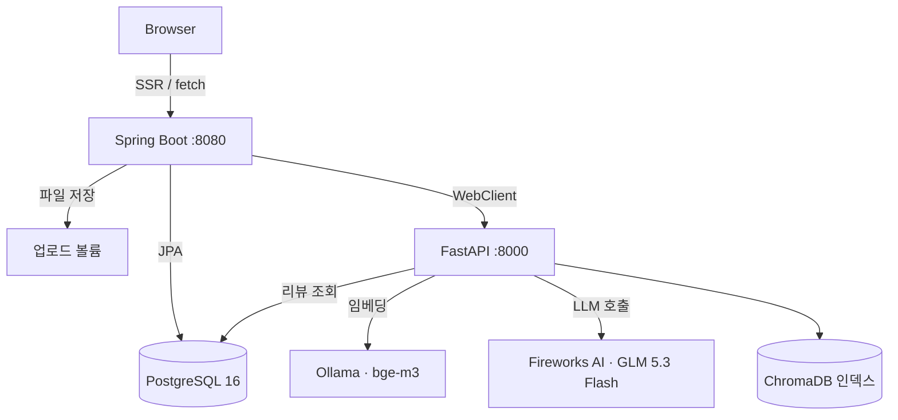
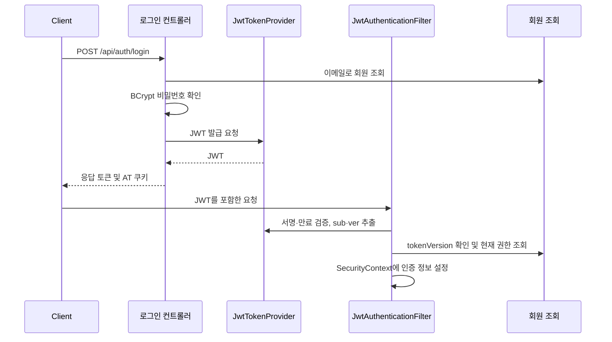

# MyPickCafe 기술 설계

> 프로젝트 개요는 README를 참고하세요. 이 문서는 주요 기능의 처리 흐름, 아키텍처, 인증·인가, 실행 방법과 테스트를 다룹니다.
> 

- **서비스 구성**: Spring Boot(회원·카페·리뷰·인증) + FastAPI(리뷰 분석·RAG 추천)
- **데이터 저장**: PostgreSQL(서비스 데이터) + ChromaDB(리뷰 벡터 인덱스)
- **AI 모델**: Ollama `bge-m3` 임베딩 + OpenAI 호환 API 기반 LLM
- **배포 환경**: Docker Compose + AWS EC2(t3.large, Ubuntu 24.04)
- **배포 주소**: MyPickCafe

## 목차

- 기술 스택
- 주요 동작 흐름
- 모델 선정
- 아키텍처 개요
- 인증 · 인가
- 로컬 실행 방법
- 테스트
- 프로젝트 기여

---

## 기술 스택

### Backend — `MyPickCafe_Springboot/`

| 구분 | 사용 기술 |
| --- | --- |
| 언어 / 빌드 | Java 17, Gradle Wrapper 8.14.3 |
| 프레임워크 | Spring Boot 3.5.5 — Web, Data JPA, Validation, Mustache |
| 인증 · 인가 | Spring Security, JWT(jjwt 0.11.5, HS256), BCrypt |
| 외부 AI 서버 호출 | WebClient — 서블릿 기반 Spring 애플리케이션에서 사용 |
| 요청 파라미터 정제 | jsoup 1.17.2, `Safelist.basic()` |
| API 문서 | springdoc-openapi 2.8.6, Swagger UI(dev 프로파일) |
| DB | PostgreSQL 16 |
| 뷰 | Mustache 서버 사이드 렌더링 + Vanilla JS |
| 배포 | Docker 멀티스테이지 빌드, Docker Compose, AWS EC2 |
| 기타 | Lombok |
| 테스트 | Spring Boot Test, Spring Security Test, H2 |

### AI 서버 — `MyPickCafe_AI/`

| 구분 | 사용 기술 |
| --- | --- |
| 서버 | Python 3.11, FastAPI, Uvicorn |
| 임베딩 | Ollama `bge-m3` — `/api/embed` |
| LLM | 로컬 기본값: Ollama `qwen2.5:14b` / 배포 설정: Fireworks AI GLM 5.3 Flash |
| LLM 연동 | OpenAI 호환 API — `/chat/completions` |
| 벡터 DB | ChromaDB `PersistentClient`, 코사인 유사도 |
| 기타 | httpx, pydantic / pydantic-settings, psycopg |

GPU가 없는 EC2 환경을 고려해 LLM 추론을 외부 API로 분리했습니다. 임베딩은 서버 내 Ollama에서 처리하며, 기존 ChromaDB 인덱스와 동일한 모델·설정을 사용합니다. `shared/llm_client.py`는 OpenAI 호환 규격을 사용해 환경변수로 로컬 모델과 외부 API를 전환할 수 있습니다.

---

## 주요 동작 흐름

### 1. 리뷰 작성 → AI 태그·감성 분석 → 카페 대표 태그 집계

`ReviewService.saveWithTags()`가 `@Transactional` 범위에서 리뷰 저장과 태그 처리를 수행합니다.

1. 리뷰를 저장하고 FastAPI `POST /review/analyze`를 동기 호출합니다.
2. AI 서버는 few-shot 프롬프트와 허용 태그 목록을 사용해 시설·메뉴·목적·분위기 태그와 감성을 추출합니다.
3. 분석 태그를 `review_tag`에 저장하고, 카테고리별 집계에서 **최다 출현 태그 개수의 85% 이상인 태그**를 카페 대표 태그(`cafe_tag`)로 선정합니다.
4. `POST /pickbot/index-one`으로 리뷰의 비동기 색인 요청을 보냅니다.

| 분류 | 값 |
| --- | --- |
| 시설 `FACILITY` | WIFI, PLUG, TERRACE, PET, PARKING |
| 메뉴 `MENU` | AMERICANO, LATTE, COLDBREW, BAKERY, CAKE, ADE, DESSERT |
| 목적 `PURPOSE` | STUDY, TALK, REST, DATE, PHOTO, MEETING |
| 분위기 `MOOD` | MODERN, RETRO, NATURE, INDUSTRIAL, CLASSIC |
| 감성 | GOOD / BAD / null |

**외부 AI 호출의 예외 처리**

태그 분석과 추천 조회는 기능의 목적에 맞춰 실패 처리 정책을 구분합니다.

| 호출 | 타임아웃 / 처리 방식 | 실패 처리 |
| --- | --- | --- |
| 리뷰 태그 분석 | 연결 2초·응답 10초, 동기 호출 | 호출 예외를 `Optional.empty()`로 변환하고 태그 처리를 건너뛰어 리뷰 저장 흐름을 이어감 |
| 리뷰 색인 | 비동기 요청 | 실패를 로그로 기록 |
| 픽봇 추천 | 응답 60초(`ai.pickbot.read-timeout-ms`), 동기 호출 | 연결·타임아웃·서버 응답·응답 형식 오류를 구분하고 `503` 반환 |

추천 호출 실패는 정상적인 빈 검색 결과와 구분해 화면에 일시적인 오류로 안내합니다.

### 2. 픽봇 — 자연어 추천 AI

`/cafes`의 픽봇 탭에서 입력한 요청은 Spring `POST /api/pickbot/recommend`를 거쳐 FastAPI `POST /pickbot/recommend`로 전달됩니다.

1. **질문 분해 — LLM 1차 호출**: `PickBot_AI/query_parser.py`에서 질문을 지역과 조건(방문 목적·분위기·메뉴·시설 등)으로 나눕니다. 통칭·역 이름은 주소의 구·동 이름에 대응시키며, 복수 지역과 제외 지역을 처리합니다. 호출 실패 시 질문 전체를 조건으로 사용합니다.
2. **지역 필터**: 포함 지역 중 하나라도 주소에 있고 제외 지역은 없는 카페를 후보로 선정합니다. 대상 지역에 후보가 없으면 `REGION_NOT_FOUND`를 반환합니다.
3. **지역만 요청한 경우**: 긍정(GOOD) 리뷰 수 → 전체 리뷰 수 순으로 상위 5곳을 선정합니다. 이 경로는 벡터 검색과 LLM 2차 호출을 생략합니다.
4. **리뷰 검색**: 조건 문장을 `bge-m3`로 임베딩하고 ChromaDB에서 코사인 유사도로 검색합니다. 카페당 리뷰 1개씩, 기본 최대 5곳을 선정하며, 이미 선정한 카페를 제외한 추가 검색으로 부족분을 채웁니다. 인덱싱 대상은 리뷰 본문입니다.
5. **조건 검증 — LLM 2차 호출**: 선정한 리뷰(카페당 1개, 최대 500자)를 조건과 함께 전달해 요구사항의 충족 여부를 판정합니다. 모든 요구사항을 충족한 카페를 유사도 순으로 반환하고, 해당 카페가 없으면 일부 조건을 충족한 후보 중 유사도 1위 1곳을 반환합니다. 충족한 조건이 없으면 빈 목록을 반환합니다.
6. **응답 구성**: 추천 이유는 충족한 조건을 근거로 작성합니다. 카페명·주소는 검색 결과에서 채우고 후보에 없는 `cafeId`는 제외합니다. Spring이 대표 사진 URL을 추가해 화면에 전달합니다.

2차 LLM 호출이 실패하면 검색 결과를 반환하도록 폴백을 두었습니다.

**리뷰 인덱스 관리**

| 시점 / 경로 | 처리 |
| --- | --- |
| FastAPI 기동 | 인덱스가 비어 있으면 PostgreSQL의 승인된 카페 리뷰로 초기 색인 |
| `POST /pickbot/index-one` | 리뷰 단건 upsert |
| `POST /pickbot/reindex` | 기존 리뷰 ID를 유지하며 누락된 ID를 추가 색인 |
| `PickBot_AI/embed_all.py` | 독립 실행 색인 스크립트 |

### 3. 니즈 기반 추천

`RecommendService`는 사용자가 선택한 니즈 태그와 카페 대표 태그 사이의 **자카르드 유사도(Jaccard)**를 계산합니다. 메인 페이지와 `/cafes?sort=recommend`에서 사용합니다.

1. 사용자 니즈를 `CATEGORY:CODE` 문자열 집합으로 변환합니다.
2. `CafeTagRepository.findApprovedCafeTagStrings()`에서 `cafe_tag`와 `cafe`를 조인해 **승인된(`APPROVED`) 카페의 태그만** 조회합니다.
3. `J(A, B) = |A ∩ B| / |A ∪ B|`로 점수를 계산하고, 0점을 제외한 뒤 내림차순으로 요청한 `limit`만큼 선정합니다.
4. 선정된 카페 정보와 대표 사진을 조회해 추천 순서대로 반환합니다.

대표 사진은 `ROW_NUMBER() OVER (PARTITION BY cafe_id ORDER BY ...)`를 이용해 **카페당 한 행만 조회**합니다. 대표 사진 여부와 `sort_index`를 기준으로 선택하며, 사진이 없으면 기본 이미지를 사용합니다. 윈도우 함수로 PostgreSQL과 H2 테스트 환경에서 같은 조회 방식을 사용합니다.

### 4. 카페 등록 → 관리자 승인 → 역할 승격

1. 사진과 사업자 증빙 파일을 포함한 등록 신청을 `PENDING` 상태로 저장하고 관리자에게 알림을 보냅니다.
2. 관리자가 신청 내용과 증빙을 확인해 승인 또는 반려합니다.
3. 승인 시 소유자가 `MEMBER`라면 `CAFEOWNER`로 변경하고, 승인·반려 결과를 점주에게 알립니다.

사진·메뉴·영업정보 수정은 역할 검사와 함께 해당 카페의 소유권을 확인합니다. 메뉴·사진에는 `CafeOwnershipGuard`를 적용하고, 영업정보와 카페 관리에는 컨트롤러 내부 검증을 사용합니다.

업로드 파일은 `file.upload-dir`에 저장하며, Docker 환경에서는 `web-uploads` 볼륨을 사용합니다.

### 5. 탐색 · 즐겨찾기 · 알림

- **메인**: 카페 카드, 태그 칩, 최근 리뷰, 로그인 사용자의 니즈 기반 추천을 제공합니다.
- **목록·검색**: 정렬과 `CATEGORY:CODE` 태그 필터, 승인된 카페의 이름·주소 검색을 지원합니다.
- **즐겨찾기**: 카페별 즐겨찾기 등록·해제와 개인 목록을 제공합니다.
- **알림**: 카페 등록, 승인·반려, 리뷰 작성 알림을 제공하며 헤더에서 12초 간격으로 안 읽은 수를 갱신합니다.

### 주요 API

전체 명세는 dev 프로파일의 Swagger UI(`/swagger-ui.html`)에서 확인할 수 있습니다.

- 기능별 엔드포인트
    
    **회원 · 인증**
    
    | 기능 | 엔드포인트 | 비고 |
    | --- | --- | --- |
    | 회원가입 | `GET/POST /signup` | BCrypt 해시 저장, 기본 역할 MEMBER |
    | 폼 로그인 | `GET/POST /login` | `AT` HttpOnly 쿠키 발급 |
    | REST 로그인 | `POST /api/auth/login` | 응답 본문 토큰 + `AT` 쿠키 |
    | 로그아웃 | `POST /api/auth/logout` | 쿠키 삭제 + `tokenVersion` 증가 |
    | 내 정보 | `GET /api/auth/me` | 로그인 회원 정보 |
    | 마이페이지 | `GET /member/me`, `GET/POST /member/edit`, `GET/POST /member/withdraw`, `GET /member/reviews` | 프로필 수정, 탈퇴, 작성 리뷰 조회 |
    | 니즈 설정 | `POST /member/needs` | 선호 태그 저장 |
    | 회원 관리 | `GET/POST /api/members`, `GET/PUT/DELETE /api/members/{id}` | ADMIN 전용, `MemberResponse` DTO 반환 |
    
    **카페**
    
    | 기능 | 엔드포인트 | 비고 |
    | --- | --- | --- |
    | 메인 | `GET /` | 카페·리뷰·추천 카드 |
    | 검색 | `GET /search?q=` | 승인된 카페의 이름·주소 검색 |
    | 목록 | `GET /cafes?sort=views\|likes\|newest\|recommend&tag=CATEGORY:CODE` | 정렬·필터, 최대 40개 |
    | 상세 | `GET /cafes/{cafeId}` | 영업정보·메뉴·리뷰·사진·즐겨찾기 수 |
    | 등록 신청 | `GET /cafes/new`, `POST /cafes/create` | 사진·증빙 업로드 |
    | 관리 / 삭제 | `GET /cafes/{cafeId}/manage`, `POST /cafes/{cafeId}/delete` | 소유권 검증 |
    | 카페 REST | `GET/POST /api/cafes`, `GET/PUT/DELETE /api/cafes/{id}` | `CafeResponse` DTO 반환, 쓰기는 CAFEOWNER·ADMIN |
    | 사진 | `GET/POST /api/cafes/{cafeId}/photos`, `PATCH /api/cafes/photos/{photoId}/main`, `DELETE /api/cafes/photos/{photoId}` | 대표 사진 지정 |
    | 영업정보 | `GET /api/cafe-infos/by-cafe/{cafeId}`, `POST /api/cafe-infos/upsert/{cafeId}`, `PUT/DELETE /api/cafe-infos/{id}` | 영업시간·공지·소개 관리 |
    | 메뉴 | `GET /api/menus/{id}`, `GET /api/menus/by-cafe/{cafeId}`, `POST /api/menus`, `PUT/DELETE /api/menus/{id}`, `POST /api/menus/{menuId}/photo` | 메뉴·사진 관리 |
    
    **관리자 · 리뷰 · 추천**
    
    | 기능 | 엔드포인트 |
    | --- | --- |
    | 관리자 대시보드 | `GET /admin` |
    | 승인 대기 카페 조회 | `GET /admin/cafes/pending` |
    | 승인 / 반려 | `POST /admin/cafes/{id}/approve`, `POST /admin/cafes/{id}/reject` |
    | 사업자 증빙 열람 | `GET /admin/cafes/{id}/bizdoc` |
    | 카페 대표 태그 재계산 | `POST /admin/cafes/tags/recalculate` |
    | 리뷰 작성 / 본인 리뷰 수정 | `POST /reviews/new`, `POST /reviews/{id}/edit` |
    | 픽봇 추천 | `POST /api/pickbot/recommend` |
    
    **즐겨찾기 · 알림**
    
    | 기능 | 엔드포인트 |
    | --- | --- |
    | 즐겨찾기 토글 | `POST /api/favorites/{cafeId}/favorite` |
    | 내 즐겨찾기 | `GET /api/favorites`, `GET /favorites` |
    | 카페별 즐겨찾기 수 | `GET /api/favorites/cafes/{cafeId}/count` |
    | 알림 목록 / 안 읽은 수 | `GET /api/notifications`, `GET /api/notifications/unread-count` |
    | 읽음 처리 | `POST /api/notifications/{id}/read`, `POST /api/notifications/read-all` |

---

## 모델 선정

### 임베딩 모델

한국어 리뷰 검색을 위해 `nomic-embed-text`에서 다국어 검색 모델 `bge-m3`로 교체했습니다. 변경은 `PickBot_AI/config.py`, 커밋 `a43c7d7`에 반영되어 있습니다.

### LLM

EC2 배포를 위해 로컬 Ollama 기반 LLM을 외부 OpenAI 호환 API로 전환했습니다. Fireworks AI의 후보 5개를 **리뷰 태그 분석·질문 분해·추천 선택** 작업으로 비교하고, 정답률·JSON 형식 안정성·응답시간·비용을 종합해 `glm-5p3-flash`를 선정했습니다.

- **비교 후보**: `glm-5p3-flash`, `deepseek-v4p1-flash`, `qwen3p8-max`, `gpt-oss-120b`, `nemotron-lightning-3p5-30b-a3b`
- **측정일**: 2026-09-18
- **공통 조건**: JSON 모드, `temperature=0`, `top_p=0.9`, `max_tokens=1000`, 재시도 없음

선정 모델의 태그 분석·질문 분해 테스트 결과는 다음과 같습니다. 수치는 각 테스트 세트 기준이며, 비용은 측정 당시 1천 건 호출 기준 추정치입니다.

| 작업 | 테스트 세트 | 정답 결과 | 평균 응답 | 1천 건 비용 |
| --- | --- | --- | --- | --- |
| 리뷰 태그 분석 | 정답 태그가 있는 리뷰 15건 | 완전일치 15/15 | 3.9초 | $0.40 |
| 질문 분해 | 퓨샷 예시와 겹치지 않는 질문 31건 | 완전정답 30/31 | 2.5초 | $0.24 |

테스트 스크립트는 `Review_Tag_AI/test_api.py`, `PickBot_AI/test_query_parser.py`, `PickBot_AI/test_pick_llm.py`에 정리했습니다.

---

## 아키텍처 개요

### 시스템 구성


```mermaid
flowchart TD
    B["Browser"] -->|SSR / fetch| S["Spring Boot :8080"]
    S -->|JPA| P[("PostgreSQL 16")]
    S -->|파일 저장| U["업로드 볼륨"]
    S -->|WebClient| F["FastAPI :8000"]
    F -->|리뷰 조회| P
    F -->|임베딩| O["Ollama · bge-m3"]
    F -->|LLM 호출| L["Fireworks AI · GLM 5.3 Flash"]
    F --> C[("ChromaDB 인덱스")]
```

`MyPickCafe_AI/app.py`는 리뷰 태그·감성 분석(`Review_Tag_AI`)과 RAG 추천(`PickBot_AI`)을 하나의 FastAPI 서버로 제공합니다. 컨테이너 간 통신은 `postgres:5432`, `ollama:11434`, `mypickcafe-ai:8000`과 같은 서비스명을 사용합니다.

### 컨테이너 구성

| 서비스 | 이미지 / 빌드 | 역할 | 기본 메모리 한도 |
| --- | --- | --- | --- |
| `mypickcafe-web` | JDK 17 → JRE 17 멀티스테이지 빌드 | Spring Boot | 1GB |
| `mypickcafe-ai` | `python:3.11-slim` 기반 빌드 | FastAPI | 2GB |
| `postgres` | `postgres:16-alpine` | 서비스 DB | 1GB |
| `ollama` | `ollama/ollama` | 임베딩 모델 서빙 | 2.5GB |
| `ollama-init` | `ollama/ollama` | 최초 모델 다운로드 후 종료 | 512MB |
- 상시 실행 컨테이너의 기본 메모리 한도 합계는 6.5GB이며, 환경변수로 조정할 수 있습니다.
- `pgdata`, `chroma-index`, `ollama-models`, `web-uploads` 볼륨에 데이터를 보관합니다. ChromaDB는 FastAPI의 `PersistentClient`로 인덱스 파일을 사용합니다.
- PostgreSQL·Ollama 헬스체크와 임베딩 모델 다운로드가 완료된 후 애플리케이션을 기동합니다.
- Spring Boot와 FastAPI 컨테이너는 비루트 사용자(uid 10001)로 실행합니다.

### Spring Boot 계층 구조

| 패키지 | 역할 |
| --- | --- |
| `api`, `controller` | REST·페이지 컨트롤러, API 예외 처리 |
| `service` | 비즈니스 로직, AI 클라이언트, 파일 저장 |
| `repository` | Spring Data JPA, JPQL·네이티브 쿼리 |
| `entity`, `domain` | JPA 엔티티, 역할·상태·태그 enum |
| `dto` | 요청 DTO, record 기반 응답 DTO |
| `security` | JWT 인증, 인가 규칙, 소유권 검증, 파라미터 정제 |
| `config`, `support` | WebClient·OpenAPI·파일 경로 설정, 공통 예외·유틸 |

### 주요 데이터 모델

| 엔티티 | 역할 |
| --- | --- |
| `Member` | 회원 정보, 역할, `tokenVersion` |
| `Cafe` | 점주, 카페 정보, 승인 상태, 사업자 증빙 경로 |
| `CafeInfo` | 카페와 1:1 — 영업시간·휴무일·공지·소개 |
| `CafePhoto`, `Menu`, `MenuCategory` | 사진·대표 사진·메뉴 관리 |
| `Review`, `ReviewTag` | 리뷰·감성·분석 태그 |
| `CafeTag`, `UserNeeds` | 카페 대표 태그·사용자 선호 태그 |
| `Favorite`, `Notification` | 즐겨찾기·알림 |

### 프로파일

| 프로파일 | DB 스키마 | 에러 응답 | Swagger |
| --- | --- | --- | --- |
| `dev` | `ddl-auto=update` | 개발용 상세 정보 | 활성 |
| `prod` | `ddl-auto=validate` | 내부 정보 미노출 | 비활성 |
| `test` | H2 인메모리, `create-drop` | 테스트 설정 | 비활성 |

`prod`는 준비된 DB 스키마를 검증하며, `CORS_ALLOWED_ORIGINS`로 허용 출처를 설정합니다.

---

## 인증 · 인가

### 설계

- **JWT 기반 인증**: `SessionCreationPolicy.STATELESS`로 세션을 사용하지 않고 요청마다 JWT를 검증합니다. 토큰은 `AT` HttpOnly 쿠키 또는 `Authorization: Bearer` 헤더로 전달합니다.
- **로그아웃 시 토큰 무효화**: 회원의 `tokenVersion`을 증가시키고, 토큰의 `ver` 클레임과 DB 값이 일치하는 경우에만 인증합니다.
- **DB 기준 권한 결정**: `CustomUserDetailsService`가 현재 역할을 조회하므로 변경된 역할이 다음 인증 요청에 반영됩니다.
- **역할·소유권 검증**: URL 인가 규칙과 `@PreAuthorize`로 역할을 검사하고, 카페별 수정 요청에는 소유권 검증을 적용합니다.
- **응답 DTO 분리**: 회원·카페 API는 엔티티 대신 record 응답 DTO를 사용해 비밀번호 해시와 점주 이메일의 응답 노출을 제한합니다.
- **요청별 실패 응답**: API는 401·403을 반환하고, 페이지 요청은 로그인 또는 메인 화면으로 이동합니다.

### 인증 흐름


```mermaid
sequenceDiagram
    participant C as Client
    participant L as 로그인 컨트롤러
    participant P as JwtTokenProvider
    participant F as JwtAuthenticationFilter
    participant D as 회원 조회

    C->>L: POST /api/auth/login
    L->>D: 이메일로 회원 조회
    L->>L: BCrypt 비밀번호 확인
    L->>P: JWT 발급 요청
    P-->>L: JWT
    L-->>C: 응답 토큰 및 AT 쿠키
    C->>F: JWT를 포함한 요청
    F->>P: 서명·만료 검증, sub·ver 추출
    F->>D: tokenVersion 확인 및 현재 권한 조회
    F->>F: SecurityContext에 인증 정보 설정
```

### 권한 구성

| 역할 | 부여 권한 |
| --- | --- |
| `MEMBER` | `ROLE_MEMBER` |
| `CAFEOWNER` | `ROLE_CAFEOWNER`, `ROLE_MEMBER` |
| `ADMIN` | `ROLE_ADMIN`, `ROLE_CAFEOWNER`, `ROLE_MEMBER` |

관리자·회원 관리 API는 `ADMIN`, 카페 REST 등록·수정·삭제는 `CAFEOWNER` 또는 `ADMIN` 권한을 확인합니다. 로그인 회원은 카페 등록 신청, 리뷰 작성, 즐겨찾기, 니즈 설정을 이용할 수 있습니다.

### JWT 구성과 담당 클래스

| 항목 | 설정 |
| --- | --- |
| 서명 | HS256 |
| 서명 키 | `JWT_SECRET`을 Base64 디코딩해 사용 |
| 클레임 | `sub`, `roles`, `ver`, `iat`, `exp` |
| 만료 시간 | 1시간(`app.jwt.expiration-ms=3600000`) |
| 허용 시계 오차 | 60초 |

| 클래스 | 역할 |
| --- | --- |
| `JwtTokenProvider` | JWT 발급, 서명·만료 검증 및 클레임 파싱 |
| `JwtAuthenticationFilter` | 토큰 추출, `tokenVersion` 비교, 인증 정보 설정 |
| `CustomUserDetailsService` | 회원 조회 및 현재 역할을 권한 목록으로 변환 |
| `MemberService.bumpTokenVersion` | 로그아웃 시 토큰 버전 증가 |
| `SecurityConfig` | 필터 체인, URL 인가, 메서드 보안, 인증·인가 실패 처리 |

---

## 로컬 실행 방법

### Docker Compose로 전체 실행

사전 준비: Docker / Docker Compose

```bash
# 저장소 루트
cp .env.example .env
```

| 환경변수 | 설명 |
| --- | --- |
| `POSTGRES_DB`, `POSTGRES_USER` | `.env.example`의 `mypickcafe` 값을 사용하거나 변경 |
| `POSTGRES_PASSWORD` | DB 비밀번호. 기존 DB 볼륨 사용 시 해당 볼륨의 비밀번호와 일치해야 함 |
| `JWT_SECRET` | Base64 시크릿. 생성 예: `openssl rand -base64 48` |
| `LLM_API_KEY` | Fireworks AI 사용 시 필요한 API 키 |
| `LLM_BASE_URL`, `LLM_MODEL`, `LLM_TIMEOUT` | `.env.example`의 LLM 설정 |
| `LLM_REASONING_EFFORT` | 배포용 GLM 설정은 `low`, 비추론 모델 사용 시 빈 값 |

```bash
docker compose up -d --build
docker compose ps
```

- 서비스: http://localhost:8080
- AI 서버 로그: `docker compose logs -f mypickcafe-ai`
- Compose가 임베딩 주소 `http://ollama:11434`를 주입합니다.
- 최초 기동 시 인덱스가 비어 있으면 승인된 카페 리뷰를 초기 색인합니다.
- 기존 ChromaDB 인덱스를 볼륨으로 옮기기
    
    ```bash
    docker volume create mypickcafe_chroma-index
    docker run --rm \
      -v mypickcafe_chroma-index:/dest \
      -v /경로/MyPickCafe_AI/chroma_db:/src:ro \
      alpine sh -c "cp -a /src/. /dest/ && chown -R 10001:10001 /dest"
    ```
    

### 개별 실행

사전 준비: JDK 17, Docker, Python 3.11, Ollama

#### 1. PostgreSQL

저장소 루트의 `.env`에 DB 설정을 작성한 뒤 실행합니다.

```bash
docker compose up -d postgres
```

#### 2. Spring Boot

환경변수 또는 `secret.properties`로 설정을 전달합니다. 환경변수가 우선하며, `secret.properties`를 사용할 때는 `MyPickCafe_Springboot` 디렉터리에서 실행합니다.

```bash
cd MyPickCafe_Springboot
cp secret.properties.example secret.properties
```

| 설정 | 값 |
| --- | --- |
| `DB_PASSWORD` | PostgreSQL 비밀번호 |
| `JWT_SECRET` | Base64 문자열, 디코딩 기준 32바이트 이상 |
| `DB_USERNAME` | 기본값 `mypickcafe` |
| `DB_URL` | 기본값 `jdbc:postgresql://localhost:5432/mypickcafe` |
| `PICKBOT_API_BASE_URL` | 기본값 `http://localhost:8000` |
| `PYTHON_API_BASE_URL` | 기본값 `http://localhost:8000` |

```bash
./gradlew bootRun
# Windows: gradlew.bat bootRun
```

- Swagger UI(dev): http://localhost:8080/swagger-ui.html
- dev 프로파일은 `ddl-auto=update`로 스키마를 생성·갱신합니다.
- 관리자 기능 확인을 위한 최초 계정은 회원가입 후 DB의 `member.role_kind`를 `ADMIN`으로 설정합니다.

#### 3. FastAPI

아래는 LLM과 임베딩을 로컬 Ollama에서 실행하는 예시입니다.

```bash
ollama pull bge-m3
ollama pull qwen2.5:14b

cd MyPickCafe_AI
pip install -r requirements.txt
python app.py
```

`MyPickCafe_AI/.env`에서 모델과 DB 설정을 지정합니다. OS 환경변수가 `.env`보다 우선합니다.

| 설정 | 값 |
| --- | --- |
| `LLM_BASE_URL` | 로컬: `http://127.0.0.1:11434/v1` / Fireworks: `https://api.fireworks.ai/inference/v1` |
| `LLM_API_KEY` | 인증이 필요한 외부 API 사용 시 지정 |
| `LLM_MODEL` | 로컬 기본값 `qwen2.5:14b`, 외부 API는 제공처의 모델 ID |
| `EMBED_BASE_URL` | 기본값 `http://127.0.0.1:11434` — `/v1` 없이 사용 |
| `EMBED_MODEL` | 기본값 `bge-m3` |
| `DB_PASSWORD` 등 | PostgreSQL 접속 정보 |
- 헬스체크: `GET http://localhost:8000/health`, `indexed` 필드로 색인된 리뷰 수 확인
- ChromaDB 기본 경로: `MyPickCafe_AI/chroma_db`
- 실행 중 누락 리뷰 추가 색인: `POST /pickbot/reindex`
- Docker 실행 시에는 루트 `.env`를 바탕으로 Compose가 환경변수를 주입합니다.

---

## 테스트

```bash
cd MyPickCafe_Springboot
./gradlew test
```

`test` 프로파일은 H2 인메모리 DB를 사용합니다. AI 클라이언트 테스트는 닫힌 로컬 포트나 로컬 HTTP 테스트 서버로 실패·응답 조건을 구성하며, 인가 테스트는 `@WithMockUser`로 인증 주체를 주입합니다.

| 테스트 | 검증 내용 |
| --- | --- |
| `MyPickCafeApplicationTests` | 애플리케이션 컨텍스트 로드 |
| `ApiAuthorizationTest` | 공개·ADMIN·CAFEOWNER 인가 규칙과 401·403·200 응답 |
| `MemberResponseLeakTest` | 회원·카페 API 응답의 비밀번호 해시·점주 이메일 제외 |
| `AiClientDegradationTest` | 태그 클라이언트의 빈 결과 반환, 비동기 색인 삭제 호출 시 예외가 즉시 전파되지 않음 |
| `PickBotClientRecommendTest` | 정상 빈 결과·호출 실패 구분, `notice` 전달, 실패 유형 분류 |
| `PickBotControllerTest` | 픽봇 장애 시 `503`과 실패 사유 반환 |
| `CafeServiceTest` | 등록 시 PENDING 상태·소유자 지정·중복 이름 거부 |
| `MemberServiceTest` | 비밀번호 해시, 기본 역할, 중복·잘못된 역할 거부, null 입력 처리 |
| `CafeManageRenderingTest` | 관리 화면 렌더링, 상세 정보 기본값, 기존 정보 유지 |
| `SearchRenderingTest` | 검색 결과의 화면 모델 전달, 미승인 카페 제외 |

**테스트 실행 기록**

| 시점 / 대상 | 결과 |
| --- | --- |
| 2026-09-28 전체 테스트 | 31개 통과 |
| 2026-09-30 관리 화면 기본값 수정·회귀 테스트 추가 후 전체 테스트 (`2d1f125` 반영) | 33개 통과 |
| 이후 관리 화면 쿠키 인증 수정 시 `CafeManageRenderingTest` | 2개 통과 |
| main `11e4381` + 메인 카드 표시 변경 상태의 `SearchRenderingTest` | 3개 통과 |

---

## 프로젝트 기여

팀 프로젝트 **GoCafe(6인, 2025-08-28 ~ 2025-10-12)**를 바탕으로 기능과 구조를 재작업했습니다.

### 팀 원본에서 이어받은 구현

- Spring Boot 도메인 구조와 회원·카페·리뷰·메뉴·즐겨찾기·알림 기본 기능
- Spring Security + JWT 인증, `tokenVersion` 기반 토큰 무효화, DB 기준 권한 결정
- 카페 승인·반려 흐름, Mustache 화면과 기본 스타일
- 팀원이 수집한 네이버 지도 카페 방문자 리뷰 데이터

### 개인 재작업·추가 범위

| 영역 | 작업 |
| --- | --- |
| 백엔드 | 태그 체계·대표 태그 집계 재정리, 니즈 기반 추천, CAFEOWNER 역할과 승인 시 역할 승격 |
| 보안 | 회원 API의 ADMIN 제한, 비밀번호 JSON 직렬화 차단, 응답 DTO 분리, 메뉴·사진 공통 소유권 검증 |
| AI 서버 | 리뷰 태그·감성 분석, 픽봇 RAG 추천, FastAPI 통합, 외부 LLM 전환, 호출별 예외 처리 |
| 화면 | 카페 목록·필터, 니즈 선택, 점주 관리, 픽봇 탭 |
| 테스트 | 인가·응답 노출·서비스 단위 테스트와 화면 렌더링 회귀 테스트 |
| 데이터 | 수집 리뷰를 활용한 더미 회원·카페·리뷰 생성 스크립트 |
| 인프라 | Dockerfile 2종, Docker Compose 구성, AWS EC2 배포 |
