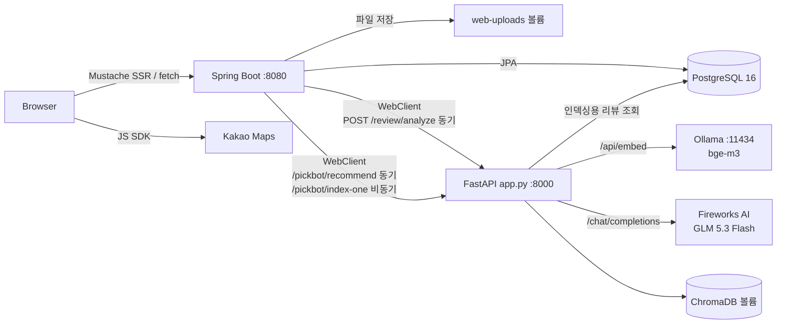

# MyPickCafe

리뷰 데이터를 기반으로 카페를 탐색하고 추천받는 웹 서비스입니다.

**🔗 배포 주소: http://15.165.218.187:8080**

## 개요

Spring Boot 웹 애플리케이션이 카페·리뷰·회원 기능을 제공하고, FastAPI 서버가 RAG 파이프라인으로 리뷰 태그 분석과 카페 추천을 담당합니다. 임베딩은 서버 내 Ollama에서, LLM 추론은 외부 API에서 처리합니다.

전체 서비스는 Docker Compose로 컨테이너 5개를 구성해 AWS EC2에 배포되어 있습니다.

## 핵심 기술

- Java 17 / Spring Boot 3.5.5 (`web`, `data-jpa`, `validation`, `mustache`)
- Spring Security + JWT(stateless), BCrypt
- JPA + PostgreSQL 16 (`docker-compose.yml`)
- FastAPI + ChromaDB
- 임베딩: `bge-m3` (Ollama 셀프 호스팅)
- LLM: GLM 5.3 Flash (Fireworks AI, OpenAI 호환 API)
- Docker / Docker Compose, AWS EC2 (t3.large, Ubuntu 24.04)

## 아키텍처



## 설계 포인트

- **JWT stateless + 토큰 무효화** — 세션을 쓰지 않고(`SessionCreationPolicy.STATELESS`) JWT로 요청마다 인증합니다. 로그아웃하면 회원의 `tokenVersion`을 1 올려, 이미 발급된 토큰도 즉시 무효가 됩니다. → [상세](ARCHITECTURE.md#인증--인가)
- **RAG + LLM 기반 자연어 카페 추천과 검색 다양성 제약** — 사용자의 자연어 요청을 `bge-m3`로 임베딩해 ChromaDB에서 유사 리뷰를 검색하고, 그 결과를 컨텍스트로 LLM이 추천 카페를 생성합니다. 이때 한 카페가 검색 결과를 독점하지 않도록 카페별 리뷰 수에 상한을 뒀습니다(1위 카페 최대 5건, 순위가 내려갈수록 1건씩 감소). → [상세](ARCHITECTURE.md#주요-동작-흐름)
- **역할이 아닌 리소스 단위 인가** — "카페 점주"인지가 아니라 "이 카페의 점주"인지를 `CafeOwnershipGuard`와 컨트롤러 내부 검증이 확인합니다. → [상세](ARCHITECTURE.md#인증--인가)
- **AI 서버 장애 격리** — `WebClient`에 연결 2초·응답 10초 타임아웃이 걸려 있고, 호출이 실패하면 예외 대신 빈 결과를 돌려줍니다. 리뷰는 태그 없이 정상 저장됩니다 (`AiClientDegradationTest`로 검증). → [상세](ARCHITECTURE.md#주요-동작-흐름)
- **LLM 추론과 임베딩의 분리 배치** — 개발 단계에서는 로컬 Ollama로 LLM과 임베딩을 모두 처리했으나, GPU가 없는 EC2 환경에서는 14B 모델 서빙이 불가능했습니다. 무거운 LLM 추론은 OpenAI 호환 외부 API로 분리하고, 가벼운 임베딩 모델(`bge-m3`)은 서버 내 Ollama에 유지해 기존 벡터 인덱스와의 일관성을 확보했습니다. 클라이언트를 OpenAI 호환 규격으로 작성해 `base_url` 변경만으로 로컬/원격 전환이 가능합니다.

## 실행 방법

```bash
cp .env.example .env    # POSTGRES_PASSWORD, LLM_API_KEY, JWT_SECRET 입력
docker compose up -d --build
# http://localhost:8080
```

루트 `.env`에 `POSTGRES_PASSWORD`, `LLM_API_KEY`, `JWT_SECRET`이 필요합니다. 자세한 실행법은 [ARCHITECTURE.md](ARCHITECTURE.md#로컬-실행-방법)를 참고하세요.

---

상세 설계·API 명세·인증 흐름 등은 [ARCHITECTURE.md](ARCHITECTURE.md) 참고.
