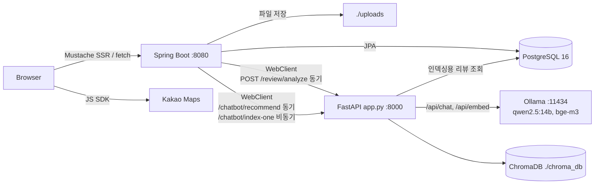

# MyPickCafe

리뷰 데이터를 기반으로 카페를 탐색하고 추천받는 웹 서비스입니다.

> **진행 상태: 로컬 실행 / 배포 진행 중** — 클라우드 배포는 아직 이루어지지 않았습니다.

## 개요

Spring Boot 웹 애플리케이션이 카페·리뷰·회원 기능을 제공하고, FastAPI 서버가 로컬 LLM(Ollama)과 연동해 리뷰 태그/감성 분석과 자연어 카페 추천(RAG)을 담당합니다. AI 기능은 Ollama로 띄운 공개 모델을 FastAPI 서버에서 HTTP로 호출하는 구조입니다.

학교 팀 프로젝트(GoCafe)를 개인적으로 이어받아 재작업한 프로젝트입니다.

## 핵심 기술

- Java 17 / Spring Boot 3.5.5 (`web`, `data-jpa`, `validation`, `mustache`)
- Spring Security + JWT(stateless), BCrypt
- JPA + PostgreSQL 16 (`docker-compose.yml`)
- FastAPI + ChromaDB + Ollama (`qwen2.5:14b`, `bge-m3`)

## 아키텍처



## 신경 쓴 부분

- **JWT stateless + 토큰 무효화** — 세션을 쓰지 않고(`SessionCreationPolicy.STATELESS`) JWT로 요청마다 인증합니다. 로그아웃하면 회원의 `tokenVersion`을 1 올려, 이미 발급된 토큰도 즉시 무효가 됩니다. → [상세](ARCHITECTURE.md#인증--인가)
- **역할이 아닌 리소스 단위 인가** — "카페 점주"인지가 아니라 "이 카페의 점주"인지를 `CafeOwnershipGuard`와 컨트롤러 내부 검증이 확인합니다. → [상세](ARCHITECTURE.md#인증--인가)
- **AI 서버 장애 격리** — `WebClient`에 연결 2초·응답 10초 타임아웃이 걸려 있고, 호출이 실패하면 예외 대신 빈 결과를 돌려줍니다. 리뷰는 태그 없이 정상 저장됩니다 (`AiClientDegradationTest`로 검증). → [상세](ARCHITECTURE.md#주요-동작-흐름)

## 실행 방법

```bash
docker compose up -d                              # PostgreSQL 16
cd MyPickCafe_Springboot && ./gradlew bootRun     # http://localhost:8080
cd MyPickCafe_AI && python app.py                 # FastAPI :8000 (AI 기능을 쓸 경우)
```

`MyPickCafe_Springboot/secret.properties`에 `DB_PASSWORD`와 `JWT_SECRET`이 필요합니다. 자세한 실행법은 [ARCHITECTURE.md](ARCHITECTURE.md#로컬-실행-방법)를 참고하세요.

---

상세 설계·API 명세·인증 흐름 등은 [ARCHITECTURE.md](ARCHITECTURE.md) 참고.
