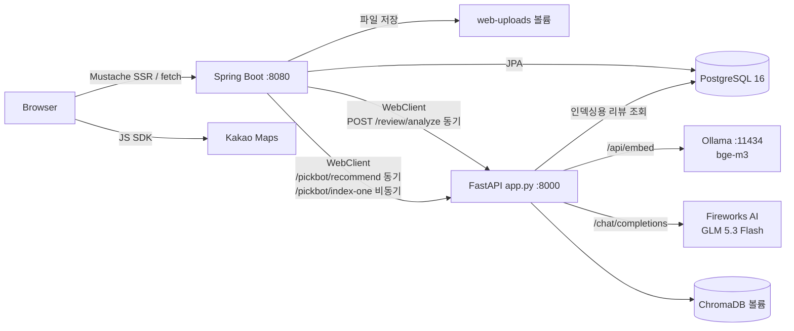

# MyPickCafe

리뷰 데이터를 기반으로 카페를 탐색하고 추천받는 웹 서비스입니다.

**🔗 배포 주소: http://15.165.105.231:8080**

## 개요

Spring Boot 웹 애플리케이션이 카페·리뷰·회원 기능을 제공하고, FastAPI 서버가 리뷰 태그 분석과 RAG 기반 카페 추천(픽봇)을 담당합니다. 저장소의 배포 설정 기준으로 임베딩은 서버 내 Ollama에서, LLM 추론은 외부 API에서 처리합니다.

Docker Compose로 전체 서비스를 구성해 AWS EC2에 배포한 프로젝트입니다. 배포 주소의 현재 접속 상태는 이번 점검에서 재확인하지 않았습니다.

## 핵심 기술

- Java 17 / Spring Boot 3.5.5 (`web`, `data-jpa`, `validation`, `mustache`)
- Spring Security + JWT(세션 미사용), BCrypt
- JPA + PostgreSQL 16 (`docker-compose.yml`)
- FastAPI + ChromaDB
- 임베딩: `bge-m3` (Ollama 셀프 호스팅)
- LLM: 배포 설정 예시는 GLM 5.3 Flash (Fireworks AI, OpenAI 호환 API), 개별 로컬 실행 기본값은 `qwen2.5:14b` (Ollama)
- Docker / Docker Compose, AWS EC2 (기존 배포 기록: t3.large, Ubuntu 24.04)

## 아키텍처

저장소의 Docker Compose 및 배포 설정 예시 기준입니다.


```mermaid
flowchart LR
    B[Browser] -->|Mustache SSR / fetch| S[Spring Boot :8080]
    B -->|JS SDK| K[Kakao Maps]
    S -->|JPA| P[(PostgreSQL 16)]
    S -->|파일 저장| U[web-uploads 볼륨]
    S -->|WebClient<br/>POST /review/analyze 동기| F[FastAPI app.py :8000]
    S -->|WebClient<br/>/pickbot/recommend 동기<br/>/pickbot/index-one 비동기| F
    F -->|/api/embed| O[Ollama :11434<br/>bge-m3]
    F -->|/chat/completions| L[Fireworks AI<br/>GLM 5.3 Flash]
    F -->|인덱싱용 리뷰 조회| P
    F --> C[(ChromaDB 볼륨)]
```

## 설계 포인트

- **세션 미사용 JWT 인증 + `tokenVersion` 기반 즉시 무효화** — Spring Security 세션을 만들지 않고(`SessionCreationPolicy.STATELESS`) 요청마다 JWT로 인증합니다. 토큰에 담긴 `tokenVersion`을 요청마다 DB의 회원 값과 비교하므로, 로그아웃 시 이 값을 1 올리면 이미 발급된 토큰도 즉시 무효가 됩니다. 세션은 두지 않되 무효화를 위해 요청마다 DB 조회를 감수한 선택입니다. → [상세](ARCHITECTURE.md#인증--인가)
- **지역은 필터로, 조건은 검색으로 — 조건 추천의 LLM 2단계 처리** — 리뷰 본문 중심의 벡터 검색만으로는 "건대입구" 같은 지역 조건을 안정적으로 보장하기 어렵기 때문에(리뷰에 지역 언급이 거의 없고, 의미상 "홍대입구"와 잘 구분되지 않음) 1차 호출로 질문을 지역과 그 밖의 조건으로 나눕니다. 지역 외 조건이 포함된 일반적인 추천 요청에서는 카페 주소 기반 정형 필터로 먼저 후보를 좁히고, 조건 문장만 `bge-m3`로 임베딩해 ChromaDB에서 유사 리뷰를 찾습니다. 2차 호출은 후보 카페가 조건을 충족하는지 판정만 하고, 반환할 카페는 코드가 정합니다. 서로 다른 카페에서 가장 유사한 리뷰를 1개씩, 기본 최대 5개 선정해 모두 2차 호출에 전달합니다. 선택한 카페는 제외하고 부족분을 추가 검색하며, 후보가 부족하면 확보된 리뷰만 전달합니다. 지역만 묻는 요청은 벡터 검색과 2차 LLM 호출을 생략합니다. → [상세](ARCHITECTURE.md#주요-동작-흐름)
- **니즈 태그 기반 자카르드 추천** — 사용자 니즈와 카페 태그의 교집합 크기를 합집합 크기로 나눠 순위를 정합니다. 점수 계산 전에 DB에서 승인된(`APPROVED`) 카페의 태그만 조회하고, 점수가 0인 카페는 제외합니다. 추천 카드의 대표 사진도 DB에서 카페당 한 행만 조회합니다. → [상세](ARCHITECTURE.md#3-니즈-기반-추천)
- **역할 + 리소스 소유권 기반 인가** — "카페 점주(`CAFEOWNER`)"인지는 역할로 먼저 검사하고, 그에 더해 "이 카페의 점주"인지를 `CafeOwnershipGuard` 등 리소스 소유권 검증으로 확인합니다(관리자는 소유권 검증 예외). → [상세](ARCHITECTURE.md#인증--인가)
- **AI 서버 장애 격리** — 리뷰 태그 분석은 `WebClient`에 연결 2초·응답 10초 타임아웃을 두고, 호출이 실패하면 예외 대신 빈 결과를 돌려줍니다. `AiClientDegradationTest`는 장애 시 태그 클라이언트의 빈 결과 반환과 비동기 색인 삭제 호출의 즉시 예외 미전파를 확인하며, 리뷰의 DB 저장·트랜잭션 커밋까지 검증하지는 않습니다. 반면 사용자가 결과를 기다리는 픽봇 추천은 실패를 빈 결과로 흡수하면 "조건에 맞는 카페 없음"과 구분되지 않으므로, 실패 원인을 분류해 로그로 남기고 `503`을 반환합니다. → [상세](ARCHITECTURE.md#주요-동작-흐름)
- **LLM 추론과 임베딩의 분리 배치** — 개발 단계에서는 로컬 Ollama로 LLM과 임베딩을 모두 처리했으나, GPU가 없는 EC2 환경의 메모리와 운영 자원 제약을 고려해 14B 모델을 직접 서빙하는 대신 외부 API를 선택했습니다. 무거운 LLM 추론은 OpenAI 호환 외부 API로 분리하고, 가벼운 임베딩 모델(`bge-m3`)은 서버 내 Ollama에 유지해 기존 벡터 인덱스와의 일관성을 확보했습니다. 클라이언트를 OpenAI 호환 인터페이스로 통일해, 현재 클라이언트의 요청 옵션과 JSON 응답 형식을 지원하는 OpenAI 호환 모델은 환경변수 설정 변경으로 전환할 수 있습니다. 모델별 호환성과 결과 품질은 별도 확인이 필요합니다.

## 실행 방법

```bash
cp .env.example .env
# .env에 POSTGRES_PASSWORD, LLM_API_KEY, JWT_SECRET 입력

docker compose up -d --build
```

실행 후 http://localhost:8080 으로 접속합니다.

- 로컬 Docker 실행은 `.env.example` 기준 `dev` 프로파일입니다. EC2 배포는 2026-09-29 운영자 확인 당시 `prod`로 정상 기동했습니다. 현재 운영 상태는 재확인하지 않았습니다.

- 임베딩 모델(`bge-m3`)은 compose의 `ollama-init` 컨테이너가 자동으로 내려받으므로 `ollama pull`을 따로 실행할 필요가 없습니다. 모델은 볼륨에 저장되어 재실행 시 다시 받지 않습니다.
- 지도 탐색 페이지를 쓰려면 `KAKAO_JS_KEY`, `KAKAO_REST_KEY`도 입력합니다. 비워 두면 지도만 동작하지 않습니다.

자세한 실행법은 [ARCHITECTURE.md](ARCHITECTURE.md#로컬-실행-방법)를 참고하세요.

---

상세 설계·API 명세·인증 흐름 등은 [ARCHITECTURE.md](ARCHITECTURE.md) 참고.
