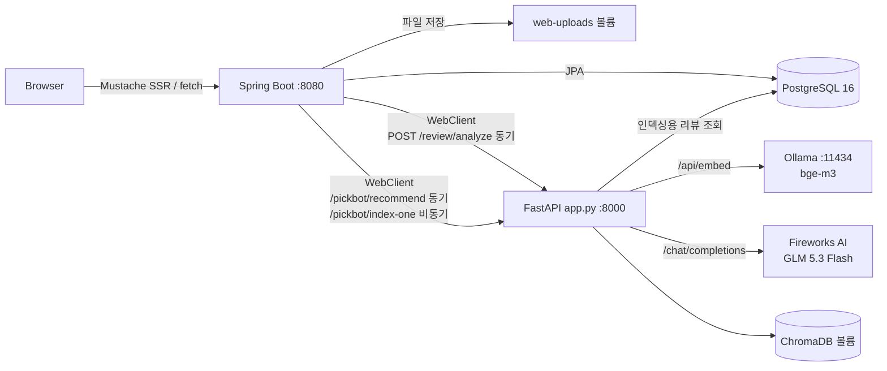

# MyPickCafe

리뷰 데이터를 기반으로 카페를 탐색하고 추천받는 웹 서비스입니다.

**🔗 배포 주소: http://15.165.105.231:8080**

## 개요

MyPickCafe는 실 방문자 리뷰를 바탕으로 취향과 목적에 맞는 카페를 찾는 서비스입니다. 원하는 조건으로 카페를 검색하거나, 자연어 질문을 통해 AI에게 카페를 추천받을 수 있습니다.

## 핵심 기술

- Java 17 / Spring Boot 3.5.5 (`web`, `data-jpa`, `validation`, `mustache`)
- Spring Security + JWT(세션 미사용), BCrypt
- JPA + PostgreSQL 16 (`docker-compose.yml`)
- FastAPI + ChromaDB
- 임베딩: `bge-m3` (Ollama 셀프 호스팅)
- LLM: 배포 설정 예시는 GLM 5.3 Flash (Fireworks AI, OpenAI 호환 API), 개별 로컬 실행 기본값은 `qwen2.5:14b` (Ollama)
- Docker / Docker Compose, AWS EC2 (기존 배포 기록: t3.large, Ubuntu 24.04)

## 아키텍처


```mermaid
flowchart LR
    B[Browser] -->|Mustache SSR / fetch| S[Spring Boot :8080]
    S -->|JPA| P[(PostgreSQL 16)]
    S -->|파일 저장| U[web-uploads 볼륨]
    S -->|WebClient<br/>POST /review/analyze 동기| F[FastAPI app.py :8000]
    S -->|WebClient<br/>/pickbot/recommend 동기<br/>/pickbot/index-one 비동기| F
    F -->|/api/embed| O[Ollama :11434<br/>bge-m3]
    F -->|/chat/completions| L[Fireworks AI<br/>GLM 5.3 Flash]
    F -->|인덱싱용 리뷰 조회| P
    F --> C[(ChromaDB 볼륨)]
```

## 주요 기능 및 설계

- **세션 미사용 JWT 인증** — 세션 없이 요청마다 JWT로 인증하고, 토큰의 tokenVersion을 DB의 회원 값과 비교합니다. 로그아웃 시 DB의 tokenVersion 값을 증가시켜 기존 토큰을 무효화합니다.
  
- **자연어 요청을 처리하는 RAG 기반 AI 카페 추천 로직** — 사용자가 자연어로 요구사항을 요청하면 1차 LLM 호출로 질문을 지역과 나머지 조건으로 나눕니다. 카페 주소로 필터링하여 후보를 좁힌 뒤 조건 문장(ex: 인터넷 빠르고, 주차장 있는 카페)만 bge-m3로 임베딩해 유사 리뷰를 검색합니다. 카페별 리뷰 1개씩 기본 최대 5개를 2차 LLM에 전달해 조건 충족 여부를 판정받아 최종 반환합니다.(카페 탐색의 '픽봇' 기능)
  
- **니즈 태그 기반 자카르드 추천** — 사용자의 니즈와 카페 태그의 교집합 크기를 합집합 크기로 나눠 순위를 정하는 자카르드 유사도 알고리즘을 사용하여 추천합니다.(카페 탐색의 '맞춤 추천' 기능)
  
- **AI 기능별 실패 처리 정책** — 리뷰 태그 분석은 `WebClient`에 연결 2초·응답 10초 타임아웃을 적용하고, 호출 실패 시 빈 결과를 반환합니다. 픽봇 추천은 장애와 ‘조건에 맞는 카페 없음’을 구분할 수 있도록 실패 원인을 분류해 로그로 남기고 503을 반환합니다.
  
- **LLM 추론과 임베딩의 분리 배치** — 개발 단계에서는 로컬 Ollama로 LLM과 임베딩을 모두 처리했으나, GPU가 없는 EC2 배포 환경의 메모리와 운영 자원 제약을 고려해 LLM 모델은 14B 모델을 직접 서빙하는 대신 외부 API를 선택했습니다. 무거운 LLM 추론은 외부 API로 분리하고, 가벼운 임베딩 모델은 서버 내 Ollama에 유지해 기존 벡터 인덱스와의 일관성을 확보했습니다.

## 담당 역할

이 프로젝트는 팀 프로젝트 GoCafe(`cfd21eb`)를 기반으로 개인적으로 이어서 개발한 후속 프로젝트입니다. Spring Boot 도메인 뼈대와 회원·카페·리뷰 등 기본 기능, Spring Security + JWT 로그인과 `tokenVersion` 기반 토큰 무효화, Mustache 화면 기본 구성, 네이버 지도 리뷰 데이터는 팀 원본에서 가져왔습니다. 이후 태그 체계 재정리와 니즈 기반 자카르드 추천, CAFEOWNER 역할 도입, 회원 API 인가 제한·응답 DTO 전환·소유권 검증 등의 보안 보완과 테스트, 리뷰 태그 분석과 픽봇 RAG 추천을 통합한 FastAPI AI 서버, 더미 데이터 생성 스크립트, Docker Compose 기반 EC2 배포를 재작업했습니다.

## 실행 방법

```bash
cp .env.example .env
# .env에 POSTGRES_PASSWORD, LLM_API_KEY, JWT_SECRET 입력

docker compose up -d --build
```

실행 후 http://localhost:8080 으로 접속합니다.

---

상세 설계·API 명세·인증 흐름 등은 [ARCHITECTURE.md](ARCHITECTURE.md) 참고.
